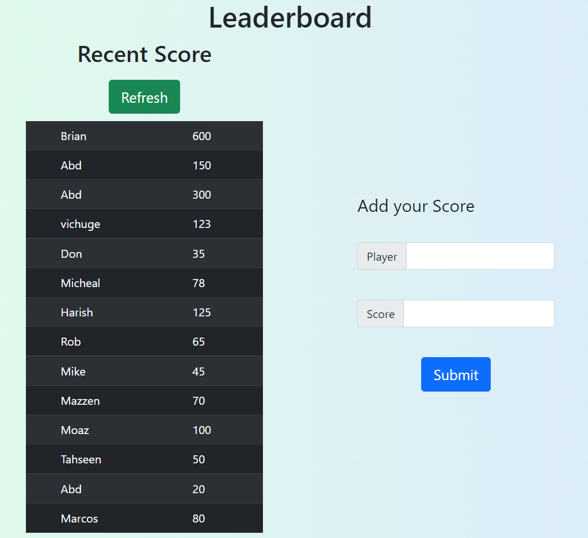

 [](https://hits.seeyoufarm.com)


# leaderboard

> The leaderboard website displays scores submitted by different players. It also allows you to submit your score. All data is preserved thanks to the external Leaderboard API service.


## Preview



## Live Demo

[Live Demo Link]()

## Built With

- HTML & CSS
- Javascript
- Webpack

## Getting Started

- Run git clone on this project at the desired directory:
   ```
   git clone https://github.com/iammouaz/leaderboard.git
   ```
- Run `npm install` to install the necessary packages to run locally
- After installing everything, run `npm start` and your default browser will open with the page

### Prerequisites

An updated web browser

### Usage

- Type the task in the text field
- Tick the checkbox to mark the task as completed
- Save modifications to the browser's Local Storage and retrieves modification from it too
- Hit enter to add a new element to the list
- Click on the checkbox to mark the task as done
- Click on the bottom button to remove the done tasks from the list
- Click on the trash can icon to remove a single element

## Authors

👤 **Mouaz El Molkey**

- GitHub: [](https://github.com/iammouaz)
- Twitter: [](https://www.twitter.com/MoazMulki1/)
- LinkedIn: [](https://www.linkedin.com/in/mohammad-mouaz-molki-1368981bb/)

## 🤝 Contributing

Contributions, issues, and feature requests are welcome!

Feel free to check the [issues page](../../issues/).

## Show your support

Give a ⭐️ if you like this project!

## Acknowledgments

To everyone in Microverse.

## 📝 License

This project is [MIT](./LICENSE) licensed.
